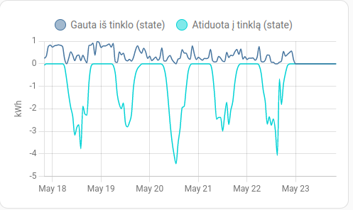

##  Manual installation 

Copy content of `custom_components` folder into your HA `/config/custom_components` folder


## Configuration

Edit your home-assistant `/configuration.yaml`  and add:

```yaml
sensor:
  - platform: eso
    username: eso_email
    password: eso_password
    selector: eso_object_number
```

This library provides only statistical info as below


How to setup read in [homeassistant section](https://www.home-assistant.io/dashboards/statistics-graph/)
